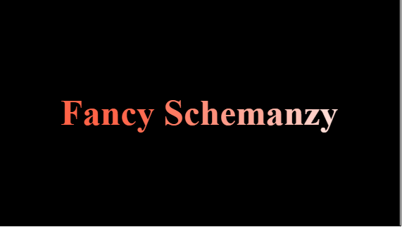

# Javascript Animation Practice

This repo is the part of my frot-end development journey. We know, JavaScript animations are done by programming gradual changes in an element's style.The changes are called by a timer. When the timer interval is small, the animation looks continuous. So, i have tried to learn and practice animation from different source. Here you will find different type of animation practice code.

## Demo

https://shajal-kumer.github.io/javascript-animation/

## Lessons Learned

Text Animation

-   split text
-   setInterval
-   add class
-   transition

Progress Bar Animation

-   getBoundingClientRect
-   scroll - add event listener
-   document.documentElement.clientHeight (html)

## Screenshots

> Text animation

## Tech Stack

**Client:** HTML, CSS, Javascript

## 🚀 About Me

I'm a front-end software engineer with backend knowledge.

## 🛠 Skills

**Front-end** : Javascript, React, Next.js, HTML, CSS, Bootstrap, Tailwind, SASS, SVG, GSAP

**Aditional Backend** : Node.js, Express.js, MongoDB, MySQL

## Acknowledgements

-   [Vanilla Javascript Text Animation Tutorial](https://www.youtube.com/watch?v=GUEB9FogoP8&list=PLDyQo7g0_nsXEOxGlAgccV8fu-cHZnI5B&index=8)

-   [Javascript Progress Bar Animation Tutorial](https://www.youtube.com/watch?v=mJ_SfLJKVs8)
